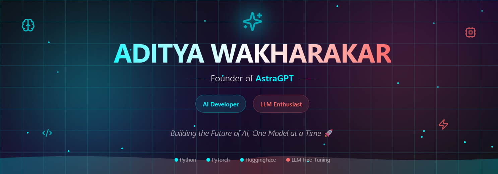

<!--Banner-->

  

<!--Header Name-->
#  ɪ'ᴍ ᴀᴅɪᴛʏᴀ ᴡᴀᴋʜᴀʀᴀᴋᴀʀ! 
*Founder of AstraGPT | AI & LLM Developer* 

<!--Start Intro-->               

I am an AI Developer and LLM Enthusiast passionate about building next-generation intelligent systems, fine-tuning Large Language Models, and creating powerful AI assistants for real-world applications 🤖🔥

- ✨ Student of life :)
- 🌱 Currently learning **Large Language Models & Fine-Tuning (QLoRA / LoRA)**
- 🇮🇳 Building **India's First AI Assistant – AstraGPT** (Coming Soon 🔥)
- ❤️ Contributing to **Open Source AI projects**
- 💻 Exploring **AI Agents, Assistants & Recommendation Systems**
- ✍ I write technical blogs about AI and Machine Learning
<!--End Intro-->

<!--Profile Count Badge-->

  

---

<!--Tech Stack Section-->       
<h2 align="center">🛠️ Tᴇᴄʜ Sᴛᴀᴄᴋ & Sᴋɪʟʟs</h2>

<h3 align="left">🚀 Core Technologies</h3>
<ul align="left">
  <li>🐍 <strong>Python</strong> - Primary programming language for AI/ML development</li>
  <li>🔥 <strong>PyTorch</strong> - Deep learning framework for model training</li>
  <li>🤗 <strong>HuggingFace</strong> - Transformers and LLM deployment</li>
  <li>⚡ <strong>FastAPI</strong> - Building high-performance AI APIs</li>
  <li>🐧 <strong>Linux</strong> - Development and deployment environment</li>
  <li>🌍 <strong>Git & GitHub</strong> - Version control and collaboration</li>
</ul>
  
<h3 align="left">🌱 Currently Learning</h3>
<ul align="left">
  <li>Fine-Tuning Large Language Models with QLoRA and LoRA techniques</li>
  <li>Advanced AI Agent architectures and multi-agent systems</li>
  <li>LLM deployment and optimization strategies</li>
  <li>Building scalable AI infrastructure</li>
</ul>

<h3 align="left">🔥 Featured Projects</h3>
<ul align="left">
  <li><a href="#">🇮🇳 <strong>AstraGPT – India's First AI Assistant</strong> (Coming Soon 🔥)</a></li>
  <li><a href="#">🔥 Fine-Tuning DeepSeek with QLoRA</a></li>
  <li><a href="#">🎯 AI-Powered Recommendation System in Python</a></li>
  <li><a href="#">🗣️ AI Voice Assistant with NLP Capabilities</a></li>
</ul>

---   
<h2 align="center">🏆 Gɪᴛʜᴜʙ Tʀᴏᴘʜɪᴇs 🏆</h2>

  <a href="https://github.com/codewith-aditya">
    <picture>
      <source media="(prefers-color-scheme: dark)" srcset="https://github-profile-trophy-ruddy.vercel.app/?username=codewith-aditya&no-bg=true&row=2&column=6&margin-w=20&margin-h=20&theme=monokai">
      <source media="(prefers-color-scheme: light)" srcset="https://github-profile-trophy-ruddy.vercel.app/?username=codewith-aditya&no-bg=true&row=2&column=6&margin-w=20&margin-h=20">
      
    </picture>
  </a>

 

<!--Github stats Table--> 
<h2 align="center">📊 Gɪᴛʜᴜʙ Sᴛᴀᴛs 📊</h2>

<table width="100%">
  <tr>
    <td width="50%">
      <h3 align="center"><strong>Gɪᴛʜᴜʙ Sᴛᴀᴛs</strong></h3>
      

        
      

    </td>
    <td width="50%">
      <h3 align="center"><strong>Sᴛʀᴇᴀᴋ Sᴛᴀᴛs</strong></h3>
      

        
      

    </td>
  </tr>
  <tr>
    <td width="50%">
      <h3 align="center"><strong>Lᴀᴛᴇsᴛ Pʀᴏᴊᴇᴄᴛ</strong></h3>
      

        
      

    </td>
    <td width="50%">
      <h3 align="center"><strong>Tᴏᴘ Lᴀɴɢᴜᴀɢᴇs</strong></h3>
      

        
      

    </td>
  </tr>
</table>
 

<!--Contribution Graph-->
<h2 align="center">📈 Cᴏɴᴛʀɪʙᴜᴛɪᴏɴ Gʀᴀᴘʜ 📈</h2>

    

---

<!--Dynamic Quote card updates everyday at 12 PM--> 
<h2 align="center">🌟 Tʜᴏᴜɢʜᴛ ᴏғ ᴛʜᴇ Dᴀʏ 🌟</h2>

<!--STARTS_HERE_QUOTE_CARD-->

    

<!--ENDS_HERE_QUOTE_CARD-->

---

<!--Contact Section--> 
<h2 align="center">🤝 Cᴏɴɴᴇᴄᴛ Wɪᴛʜ Mᴇ 🤝 </h2>

  

 

<!--Buy me a coffee-->

---

### 🌟 "Building the Future of AI, One Model at a Time" 🌟

Made with ❤️ by Aditya Wakharakar

<!--Footer--> 

  

